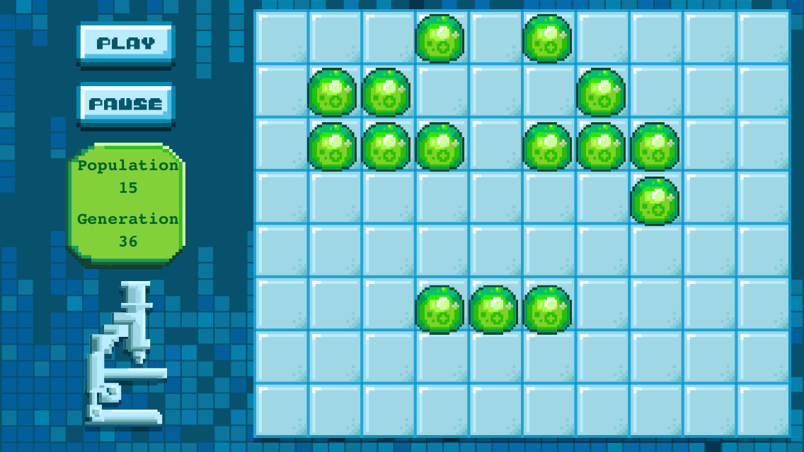

#Learn to build the Game of Life with SpriteBuilder

This is the repository for the MakeGamesWithUs Tutorial on Game of Life in SpriteBuilder. Visit [MakeSchool.com](https://www.makeschool.com/tutorials/game-of-life-spritebuilder/) to learn more about this tutorial.

